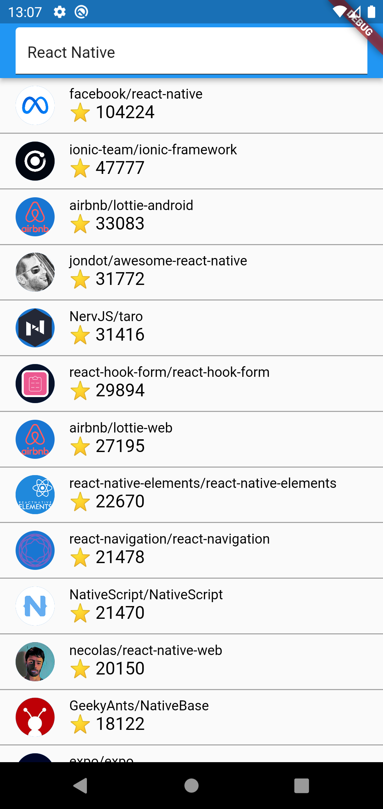

# flutter_github_api

## Flutterの教科書 実践課題

### 第10章 フリー画像検索アプリ【改善】

B. 無料の API を使ってサービスを作ってみよう
Pixabay 以外にも無料で使える API はたくさんあります。いくつか例を挙げますのでその中から一つ選び簡単なサービスを作ってみましょう。

- NHK 番組表 API 
NHK の１週間の番組表が取得できます。ジャンル等で絞り込むこともできます。
- 楽天ブックス総合検索 API 
楽天ブックスの検索機能を使えます。
- QuizAPI 
英語ですがさまざまなクイズを取得できます。
- GitHub API 
GitHub に対するさまざまな操作を実行できます。
- Poke API 
ポケモンに関するさまざまな情報を取得できます。

### ◆機能の説明
今回は GitHub API を使用

基本的にはフリー画像検索アプリ（Pixabay）と同じでApiをたたいて、取得したデータをリストで表示する。

今回だと検索した文字列に関係するGitHubの公開レポジトリで、 
レポジトリの名前とスターの数、アイコンが表示される。

また、それぞれのリストをタップしたらそのレポジトリのページにリンクが飛ぶ。

### ◆上記の課題の完成図

初期画面

検索欄に「React Native」を入力した時

